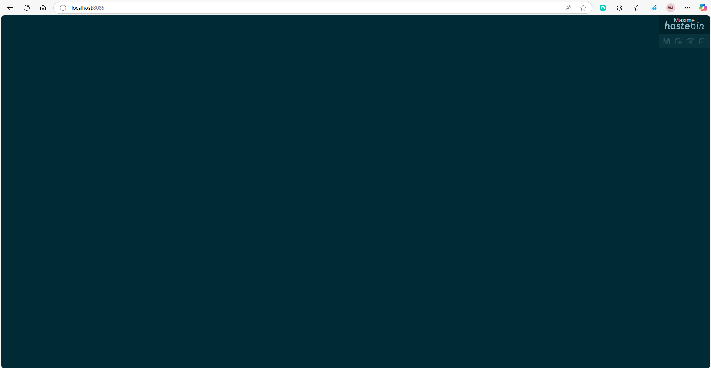
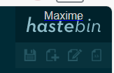

# Documentation

> Maxime Bardy

## Etapes pour lancer et construire notre Dockerfile

1. Crée notre Dockerfile. Il doit contiendres les choses suivantes : 

```Dockerfile
# 1. on part d'une image de node à la version 18-alpine
FROM node:18-alpine

# 2. Installer git
RUN apk add --no-cache git bash

# 3. Dossier de travail dans le conteneur
WORKDIR /app

# 4. Arguments pour passer l’URL et la branche au build
ARG REPO_URL=https://github.com/toptal/haste-server.git
ARG BRANCH=master

# 5. Clonage du repo
RUN git clone --depth 1 --branch "$BRANCH" "$REPO_URL" .

# 6. On copie tout les fichiers du repo
COPY . .

# 7. On installe les dépendances
RUN npm install

# 8. On change les fichiers par nos fichiers
COPY settings/index.html static/index.html

# 9. Pareil
COPY settings/config.json config.js

# 10. On expose le port 8085
EXPOSE 8085

# 11. On lance le tout
CMD ["npm", "start"]
```

# Les personnalisations apportées

Tout d'abord j'ai du donc changer mon nom dans le fichiers index.html que j'ai laisser dans mon dossiers settings. J'ai du donc changer cette ligne : 

```html 

style="padding: 10px; text-align: center; color: #ccc; font-family: sans-serif;">Maxime</span></a>

```

Pour mettre mon nom.

Puis cette ligne pour mettre mon prénom et mon nom : 

```html 

    <title>hastebin - De Maxime Bardy</title>

```

J'ai retiré cette ligne avec twitter : 

```js 

    app = new haste('hastebin', { twitter: true, baseUrl: baseUrl });

```

J'ai ensuite changé ça dans mon fichiers config.json : 

```json 

    {
    "host": "0.0.0.0",
    "port": 8085,
    "keyLength": 5,
    "maxLength": 10,
    "staticMaxAge": 86400,
    "recompressStaticAssets": true,
    "storage": {
        "type": "file",
        "path": "./data"
    },
    "documents": {},
    "keyGenerator": {
        "type": "random",
        "keyspace": "abcdefghijklmnopqrstuvwxyz0123456789"
    }
}

```

Donc les ports, la keyLength, et la maxLength. 

# Commandes 

Pour lancé l'application j'ai donc fais un : 
`docker build -t hastebin-app .` et puis ensuite un : `docker run -p 8085:8085 hastebin-app`

Puis je suis aller sur : `http://localhost:8085/`.

# Screen



Sur ces 2 captures on peut voir que mon nom à bien été modifier


